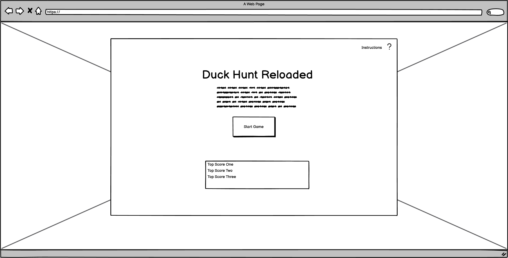
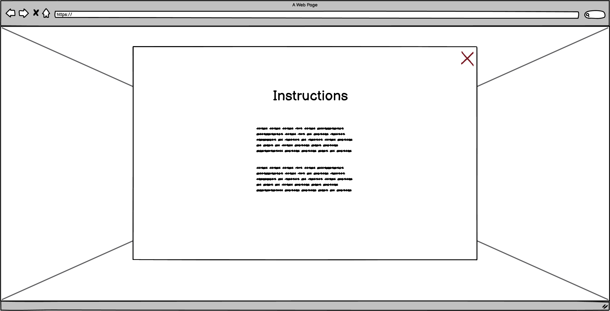

# DuckHunt Reloaded

Proudly present our retro game: DuckHunt Reloaded

[View DuckHunt Reloaded github pages ](#)

---

## CONTENTS

* [User Experience](#user-experience-ux)
  * [User Stories](#user-stories)

* [Design](#design)
  * [Colour Scheme](#colour-scheme)
  * [Typography](#typography)
  * [Imagery](#imagery)
  * [Wireframes](#wireframes)

* [Features](#features)
  * [General Features on Each Page](#general-features-on-each-page)
  * [Future Implementations](#future-implementations)
  * [Accessibility](#accessibility)

* [Technologies Used](#technologies-used)
  * [Languages Used](#languages-used)
  * [Frameworks, Libraries & Programs Used](#frameworks-libraries--programs-used)

* [Deployment & Local Development](#deployment--local-development)
  * [Deployment](#deployment)
  * [Local Development](#local-development)
    * [How to Fork](#how-to-fork)
    * [How to Clone](#how-to-clone)

* [Testing](#testing)

* [Credits](#credits)
  * [Code Used](#code-used)
  * [Content](#content)
  * [Media](#media)
  * [Acknowledgments](#acknowledgments)

---

## User Experience (UX)

### Initial Discussion

DuckHunt Reloaded is the rethinking of the old classic DuchHunt

### User Stories

#### Client Goals

#### First Time Visitor Goals

#### Returning Visitor Goals

#### Frequent Visitor Goals

## Design

### Colour Scheme

### Typography

### Imagery

### Wireframes

#### Menu

#### Instructions

#### End Game

## Features

### General features on each page

### Future Implementations

### Accessibility

## Technologies Used

### Languages Used

* HTML
* CSS
* JavaScript

### Frameworks, Libraries & Programs Used

* [Balsamiq](https://www.balsamiq.com/wireframes "Balsamiq Wireframing Tool") was used to create the wireframes/sitemap for the site.

## Deployment & Local Development

### Deployment

Github Pages was used to deploy the live website. The instructions to achieve this are below:

1. Log in (or sign up) to Github.
2. Find the repository for this project, Nmyhi/cogniCraft.
3. Click on the Settings link.
4. Click on the Pages link in the left hand side navigation bar.
5. In the Source section, choose main from the drop down select branch menu. Select Root from the drop down select folder menu.
6. Click Save. Your live Github Pages site is now deployed at the URL shown.

### Local Development

#### How to Fork

To fork the Nmyhi/cogniCraft repository:

1. Log in (or sign up) to Github.
2. Go to the repository for this project, Nmyhi/cogniCraft.
3. Click the Fork button in the top right corner.

#### How to Clone

To clone the Nmyhi/cogniCraft:

1. Log in (or sign up) to GitHub.
2. Go to the repository for this project, Nmyhi/cogniCraft.
3. Click on the code button, select whether you would like to clone with HTTPS, SSH or GitHub CLI and copy the link shown.
4. Open the terminal in your code editor and change the current working directory to the location you want to use for the cloned directory.
5. Type 'git clone' into the terminal and then paste the link you copied in step 3. Press enter.

## Testing

## Credits

### Code Used

### Content

###  Media

  
###  Acknowledgments